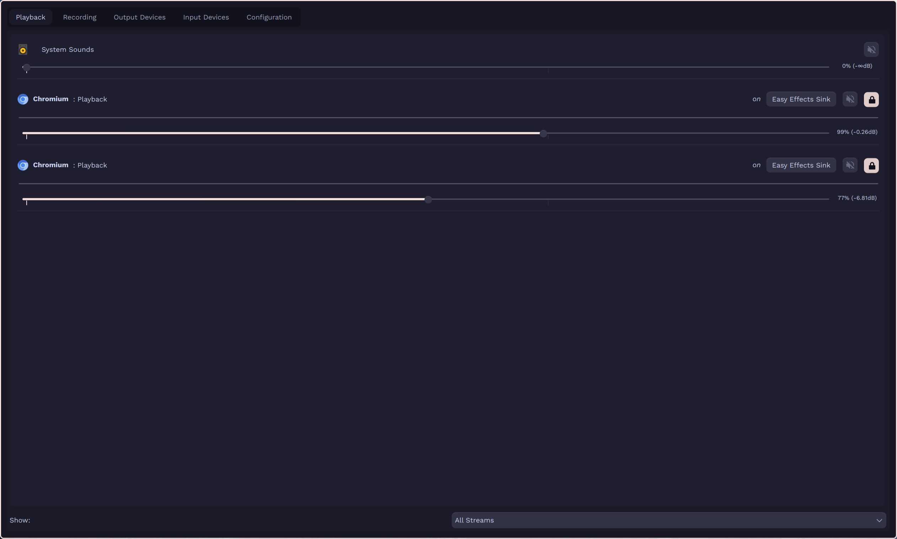
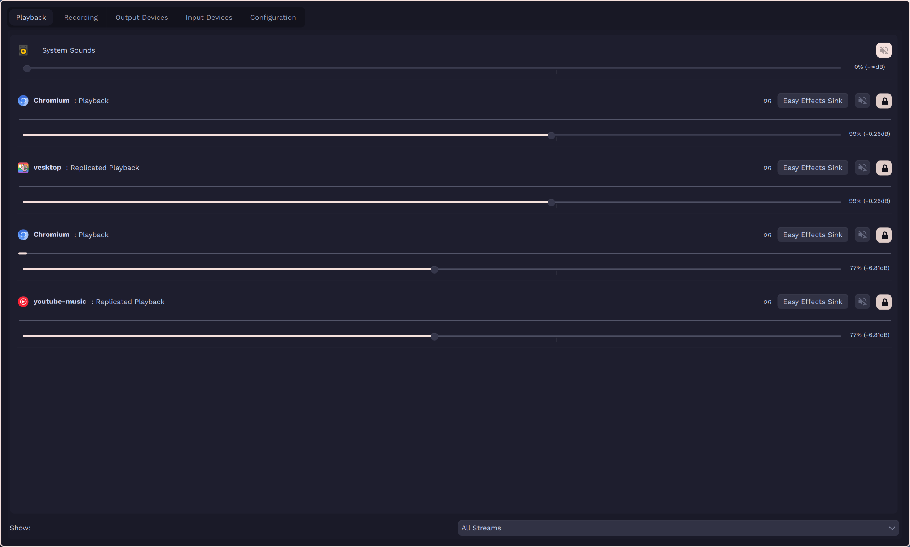

# Pipetron

Pipetron (**Pipe**Wire + Elec**tron**) is a third-party daemon to fix Electron app audio streams naming conflicts in PipeWire. Electron apps have a long-running issue with being unable to change its audio stream names from the permanent "Chromium" string. The issue stretches from minor annoyances such as difficulty differentiating Electron apps within volume controllers, to more major issues with services that depends on PipeWire nodes' names, which includes WirePlumber and qpwgraph.

To be more specific, the issue causes WirePlumber to reset all Electron apps to the same audio setting as it cannot differentiate Electron apps from one another. qpwgraph's related issue is mentioned in [#4](https://codeberg.org/ponleou/pipetron/issues/4).

## Usage

```
Usage: pipetron [options]

Options:
  -h, --help              Show this help message
  -v, --version           Show version
  -d, --daemon            Start daemon specified in config file (defaults to volume daemon if not specified)
  -vd, --volume-daemon    Start volume daemon (mirror volume settings), daemon type "volume" in config file
  -ad, --audio-daemon     Start audio daemon (mirror audio data), daemon type "audio" in config file
```

A config file can be created in `~/.config/pipetron/config.toml` using the following template:

```toml
[daemon]
type = "volume" # or "audio"
```

Pipetron comes with two different daemons, **volume** and **audio** daemon.

### Volume daemon

Volume daemon uses a simple approach to solve the issue: replicate all Electron audio streams with its actual Electron app name and icons, and make a one-way sync of its volume settings from the replicated stream to its corresponding Electron stream. This daemon is a light-weight solution aimed to solve the annoyance issue, and WirePlumber's dependency on node's names to save volume settings. This, however, does not solve the general issue.

### Audio daemon

Audio daemon works by also replicating all Electron audio streams with its actual app name and icons, but also transfers the audio data from the original Electron streams into the replicated stream. It aims to be integrated seamlessly with daily audio usages, ensuring link isolation of the original Electron stream, and the expected link connection with the replicated streams. As a byproduct, the solution can be more bloated, but should solve the general issue regarding Electron and PipeWire.

> May 8: I've been personally using the audio daemon for the past 4 months daily without issues, so I'd say it's safe to remove the experimental labelling. Audio capture will be worked on starting June.

> [!IMPORTANT]
> This daemon is implemented only for audio playbacks, while **audio capture is currently not planned** (falling back to the volume solution). If you feel an audio capture daemon is necessary for your usage, feel free to open an [issues](https://codeberg.org/ponleou/pipetron/issues) or [PRs](https://codeberg.org/ponleou/pipetron/pulls) to let me know it is a wanted feature.

## Images

Without Pipetron:



With Pipetron:



## Installing

### Arch Linux

Pipetron is available in the [AUR](https://aur.archlinux.org/packages/pipetron) (maintained by [me](https://codeberg.org/ponleou)).

```
yay -S pipetron
```

By default, Pipetron's systemd service `pipetron.service` will be enabled and will start in the next session. To start it immediately:

```
systemctl --user start pipetron.service
```

### Manual build

**[DISCLAIMER]** this project is very young, and is currently untested within other distros besides Arch Linux. Feel free to create [issues](https://codeberg.org/ponleou/pipetron/issues) or [PRs](https://codeberg.org/ponleou/pipetron/pulls) on package maintainers.

#### Requirements

- `systemd`
- `meson`
- `pipewire` and `libpipewire`
- `tomlplusplus`

```
git clone -b stable --single-branch https://codeberg.org/ponleou/pipetron.git
cd pipetron
meson setup build
meson compile -C build
sudo meson install -C build
```

Start and enable the systemd service by:

```
systemctl --user enable --now pipetron.service
```
